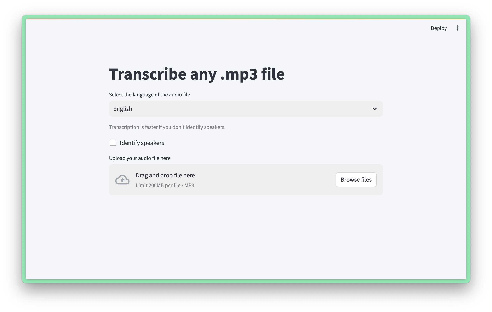

# Transcribe this

This is a streamlit app I created to solve my own problem of occasionally needing transcripts of recordings (most often from my phone). The app is also hosted on Streamlit's community cloud.

This is what it looks like.

It's also running [on the Streamlit community cloud](https://github.com/DominiquePaul/transcribe-this), but you'd need a password to acccess it. Reason being the cost of the transcription API.



# Replicating

### Environment variables

To add the necessary environment variables, create a file named `.streamlit/secrets.toml` in the root directory of your project and add the following content to it:

```
OPENAI_API_KEY="your_openai_api_key"
ASSEMBLYAI_API_KEY="your_assemblyai_api_key"
PASSWORD="your_password"

# Note: Initially I saved my recordings and transcripts to a DB, but this turned
# out to be annoying since I was using the free Supabase plan and had to manually
# wake up the DB after not using it for a while
SUPABASE_URL="your_supabase_url"
SUPABASE_KEY="your_supabase_key"
SUPABASE_BUCKET_NAME="your_supabase_bucket_name"
```

### Running the app

Run the app with the command:

`streamlit run main.py`

